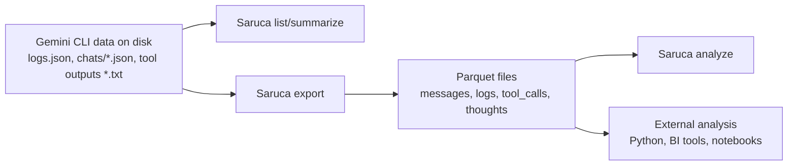

# Saruca: A Gemini CLI Log & Session Analyzer.


Mining log and session data from Gemini CLI using Polars for high-performance analysis.

## Features

- **Discovery:** Automatically find logs and session JSON files in project directories.
- **Analysis:** Detailed summaries including message types, project activity, token usage, tool calls, and thoughts.
- **AI Summarization:** Use Gemini models to summarize conversation threads and project outcomes.
- **Export:** Convert nested session data into flat Parquet tables for easy processing in other tools.
- **Analysis (Parquet):** Deep dive into exported Parquet data with statistical summaries of sessions, projects, and tool usage.
- **Tool Outputs:** Ingest tool output `.txt` JSON blobs into a unified table.
- **Data-centric:** Built on Polars, Orjson, Pydantic, and Click.

## Requirements

- **Python:** 3.13 or higher.
- **API Key (optional):** `GOOGLE_API_KEY` or `GEMINI_API_KEY` for AI summaries.

## Data Sources

Saruca searches for:
- `logs.json` files (Gemini CLI logs)
- `chats/*.json` session files
- Tool output `.txt` files containing JSON (for `export-all`)
- Security event exports like `search_security_events_*.txt`, `search_udm_*.txt`, and `*_events.json`

By default it scans the provided `--path` recursively, plus `.gemini-tmp/` if it exists.

## Data Flow



## Usage

```
mfranz@cros-acer516ge:~/github/saruca$ uv run saruca list 

Found 9 log files and 16 session files.

Activity Range: 2025-11-23 13:31:27.761000+00:00 to 2026-02-09 13:38:30.891000+00:00 (78 days, 0:07:03.130000)

--- Token Usage ---
  Input: 4,034,352
  Output: 30,800

--- Models Used ---
  gemini-2.5-pro: 40 messages
  Unknown: 36 messages
  gemini-2.5-flash: 23 messages
  gemini-3-flash-preview: 15 messages
  gemini-3-pro-preview: 6 messages

--- Top Tools ---
  run_shell_command: 24 calls
  read_file: 22 calls
  write_file: 15 calls
  replace: 5 calls
  write_todos: 4 calls

--- Top Projects ---
  c0b520bffb14... :   26 msgs | review all my git commits of the last year and create a summary of topics by mon...
  aab95ba156c0... :   24 msgs | review @rules-bank/** and https://geminicli.com/docs/cli/skills/ and define an a...
  2552096b5459... :   16 msgs | create a README.md for the files in this directory that creates necessary AWS re...
  449836599a00... :   15 msgs | update @duckdb-sync.py so that it can use this MCP server, update prompts to rem...
  30ea931399a6... :   13 msgs | Modify @duckdb_async.py so that instead of a hardcoded prompt it asks the user f...
mfranz@cros-acer516ge:~/github/saruca$ uv run saruca summarize --project 2552096b5459

Summarizing Session: 6d73e47d-731a-477c-b927-7539c644d813
Both GOOGLE_API_KEY and GEMINI_API_KEY are set. Using GOOGLE_API_KEY.
Title: README.md Creation for AWS S3 Monitoring with Vector
Key Points:
  - Analyzed `s3_events.py` which configures S3 object creation notifications to an SQS queue via command-line inputs.
  - Analyzed `s3-sqs.yaml`, a CloudFormation template provisioning an SQS queue, its policy for S3 access, an IAM user with read/write policies for the bucket and queue, and an access key stored in SSM.
  - Analyzed `s3sqs-console.yaml` for Vector configuration details.
Outcome: Successfully created a `README.md` file detailing prerequisites, deployment steps, S3 bucket configuration, instructions for running Vector, environment variables, and cleanup procedures for the AWS resources.
----------------------------------------

Summarizing Session: 8104cb9e-518f-42de-b884-dcfe63abf69b
Both GOOGLE_API_KEY and GEMINI_API_KEY are set. Using GOOGLE_API_KEY.
Title: Metrics Collection and API Enablement in s3sqs-console.yaml
Key Points:
  - The user requested to add metrics collection and enable the API in the `s3sqs-console.yaml` file.
  - The AI model confirmed it would add an internal metrics source, a Prometheus exporter sink for metrics collection, and enable the API in the file.
  - The AI model proceeded to update the `s3sqs-console.yaml` file with the new configurations.
Outcome: The `s3sqs-console.yaml` file was successfully updated to include metrics collection and enabled API.
```


## Quick Start

### Installation

```bash
uv venv
source .venv/bin/activate
uv sync
uv pip install -r requirements.txt
uv pip install -e .
```

### Usage

#### Analyze and List Sessions

Get a detailed summary of activity in the current directory, including token usage, model breakdown, and top projects.

```bash
uv run saruca list --path .
```

**Options:**
- `--verbose`: Include full conversation history in the output.
- `--project <hash>`: Filter results by project hash (prefix matching).
- `--all`: List all projects, not just the top 5.
- `--thought`: Show model thoughts (if present).

#### AI Summarization

Generate AI-powered summaries for all sessions within a specific project. This requires a Gemini API key (set via `GOOGLE_API_KEY` or `GEMINI_API_KEY`).

```bash
uv run saruca summarize --path . --project <project_hash>
```

#### Export Data

Export everything (messages, logs, tool calls, thoughts, tool outputs, security events, chat logs) to Parquet for external analysis.

```bash
uv run saruca export --path . --prefix unified_
```

#### Analyze Exported Data

Analyze the exported Parquet files to get high-level statistics and insights.

```bash
uv run saruca analyze --path .
```

**Options:**
- `--prefix <string>`: If you used a prefix during export, specify it here.

This command provides:
- General stats (row counts and time ranges for all tables).
- Session analysis (average messages, tokens, and top longest sessions with AI summaries).
- Project analysis (session counts and top projects by token usage).
- Tool usage analysis (top tools and success/error/cancelled breakdown).
- Thought patterns (top subjects found in model thoughts).

### Utility Scripts

- **`./sync_logs.sh`**: Syncs logs from the default Gemini CLI temporary directory (`~/.gemini/tmp/`) to the local `.gemini-tmp/` directory, excluding unnecessary files.
- **`./export_unified.sh`**: Automatically exports all discovered sessions and logs from `.gemini-tmp/` into unified `sessions_unified.parquet` and `logs_unified.parquet` files.

## Exploration

The project includes several tools for data exploration:

- **`analysis_notebook.py`**: An interactive [marimo](https://marimo.io/) notebook for visualizing message types and activity over time.
- **`explore_data.py`**: A script to quickly preview data summaries, including token usage analysis by model.
- **`analyze_tools.py`**: A utility specifically for analyzing tool usage and arguments across all sessions.
- **`dig_into_data.py`**: A utility for diving into the actual content of conversations within specific sessions.
